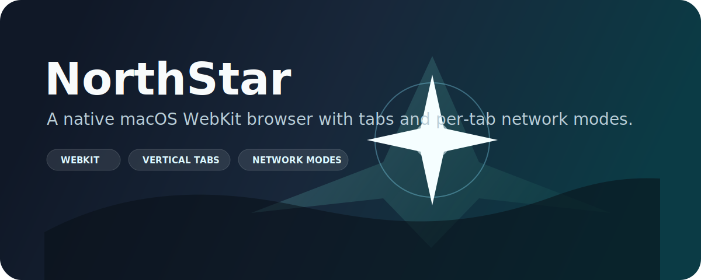
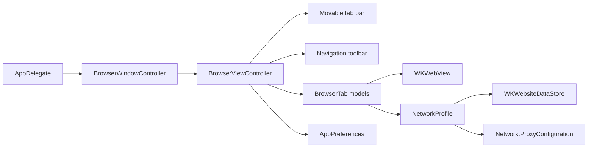

<p align="center">
  
</p>

<p align="center">
  
  
  
  
</p>

# NorthStar

NorthStar is a small native macOS browser built with Swift, AppKit, and Apple's WebKit. It is meant to be fast to understand, easy to extend, and useful as a foundation for experimenting with browser UX, private sessions, proxy-backed browsing, and local development workflows.

The first version keeps the surface intentionally focused: one window, a polished Russian-language NorthStar home screen, movable tabs, a smart address bar, browser navigation controls, a settings tab, theme and color-scheme selection, browser design density, search engine selection, history, download history, lightweight performance monitoring, and a per-tab network selector.

## Highlights

- Native macOS app bundle, no Electron runtime.
- `WKWebView` rendering with AppKit window and menu integration.
- Thin Chrome-style tabs with active-state accents and configurable placement: left, top, right, or bottom.
- NorthStar home screen with integrated search and quick links.
- Smart address bar that accepts URLs, localhost addresses, file URLs, or search text.
- Search engine picker in the toolbar, on the home screen, and in Settings.
- Built-in engines: DuckDuckGo, Google, Yandex, Brave, Bing, Ecosia, and Startpage.
- Settings open as a first-class internal tab instead of a modal sheet.
- Browsing history and download history are available from the Settings tab.
- Appearance controls include six color schemes and four interface designs.
- Lightweight browser performance snapshot in Settings: tab count, loading tabs, app memory, average load time, and recent page timings.
- Always-on ad blocking with WebKit content rules, host blocking, and DOM cleanup for injected ad containers.
- Safari-like user agent to reduce search-engine bot challenges from custom WebKit fingerprints.
- Theme picker for System, Light, and Dark.
- Per-tab network modes: System, Private, Tor SOCKS, and Localhost.
- New-window handling opens links into a new NorthStar tab instead of losing context.
- Build script that produces `Build/NorthStar.app`.

## Settings

Open settings with `Command-,`, the gear button in the toolbar, or `northstar://settings` in the address bar.

| Setting | Options |
| --- | --- |
| Search engine | DuckDuckGo, Google, Yandex, Brave, Bing, Ecosia, Startpage |
| Tabs position | Left, Top, Right, Bottom |
| Theme | System, Light, Dark |
| Color scheme | Aurora, Graphite, Ocean, Forest, Rose, Amber |
| Design | Balanced, Compact, Spacious, Focus |

Settings are saved with `UserDefaults`, so the app remembers your preferred search engine, theme, color scheme, design density, and tab layout between launches.

You can also switch the search engine directly from the toolbar or from the NorthStar home screen before running a search.

The Settings tab also includes browsing history, download history, quick clear actions for both lists, and a lightweight performance section for the current window.

## Network Modes

| Mode | Behavior | Best for |
| --- | --- | --- |
| System | Uses the default macOS network path and persistent WebKit website data. | Everyday browsing and signed-in sessions. |
| Private | Uses a non-persistent `WKWebsiteDataStore`. | Quick private sessions without keeping cookies/cache. |
| Tor SOCKS | Uses non-persistent data and routes WebKit traffic through `127.0.0.1:9050` with failover disabled. | Browsing through a local Tor/SOCKS5 service. |
| Localhost | Uses non-persistent data and blocks navigation outside local files, `localhost`, `127.*`, `0.0.0.0`, and `::1`. | Web development and testing local apps. |

Tor SOCKS mode expects a local SOCKS5 proxy, such as Tor, to already be running on `127.0.0.1:9050`.

When a tab's network mode changes, NorthStar recreates that tab's `WKWebView` with a new WebKit data store. The current URL is preserved when the target mode allows it, but back/forward history starts fresh for that tab.

## Keyboard Shortcuts

| Shortcut | Action |
| --- | --- |
| `Command-T` | New tab |
| `Command-W` | Close tab |
| `Command-,` | Settings |
| `Shift-Command-W` | Close window |
| `Command-L` | Focus address bar |
| `Command-R` | Reload or stop loading |
| `Command-[` | Back |
| `Command-]` | Forward |
| `Shift-Command-[` | Previous tab |
| `Shift-Command-]` | Next tab |

## Requirements

- macOS 14 or newer.
- Apple Command Line Tools with Swift available.
- Xcode is optional for this SwiftPM-based prototype.

Check your toolchain:

```bash
swift --version
```

## Build And Run

Clone the repository:

```bash
git clone https://github.com/Zulut30/NorthStar.git
cd NorthStar
```

Build the `.app` bundle:

```bash
./Scripts/build-app.sh
```

Open the app:

```bash
open Build/NorthStar.app
```

For a quick development run:

```bash
swift run NorthStar
```

## Project Structure

```text
NorthStar/
├── Package.swift
├── README.md
├── Resources/
│   ├── Info.plist
│   └── NorthStarBanner.svg
├── Scripts/
│   └── build-app.sh
└── Sources/
    └── NorthStar/
        └── main.swift
```

## Architecture

NorthStar is currently a compact single-target SwiftPM app.



Core pieces:

- `BrowserViewController` owns the window UI, active tab state, navigation actions, and WebKit delegates.
- `BrowserTab` wraps a `WKWebView` and observes title, URL, progress, loading, and history state.
- `AppPreferences` stores theme, search engine, and tab placement in `UserDefaults`.
- `BrowserHistoryStore` and `DownloadHistoryStore` persist local history lists in `UserDefaults`.
- `PerformanceMonitor` records recent page load timings and snapshots current app memory only when settings are rendered.
- `NetworkProfile` creates the WebKit configuration for each mode before a page starts loading.
- `AdBlocker` installs WebKit content rules, blocks known ad hosts, and removes visible ad containers.
- `NetworkPolicy` blocks disallowed URLs in Localhost mode.

## Roadmap

- Bookmarks UI.
- Find in page.
- Per-site permissions.
- Optional custom SOCKS/HTTP proxy settings.
- App icon and signed release packaging.

## Design References

NorthStar is a fresh implementation. The following projects are useful references for product direction and browser UX patterns:

- [nuance-dev/Web](https://github.com/nuance-dev/Web)
- [the-ora/browser](https://github.com/the-ora/browser)
- [nook-browser/Nook](https://github.com/nook-browser/Nook)
- [browseros-ai/BrowserOS](https://github.com/browseros-ai/BrowserOS)

## License

No license has been selected yet. Add one before distributing or accepting outside contributions.
