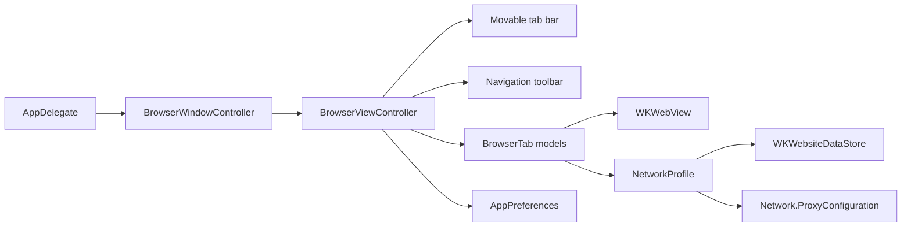

<p align="center">
  
</p>

<p align="center">
  
  
  
  
</p>

# NorthStar

NorthStar is a small native macOS browser built with Swift, AppKit, and Apple's WebKit. It is meant to be fast to understand, easy to extend, and useful as a foundation for experimenting with browser UX, private sessions, proxy-backed browsing, and local development workflows.

The first version keeps the surface intentionally focused: one window, a polished Russian-language NorthStar home screen, movable tabs, a smart address bar, browser navigation controls, labeled toolbar actions, a settings tab, theme and color-scheme selection, browser design density, search engine, region, and language selection, history, download history, lightweight performance monitoring, and private browsing.

## Highlights

- Native macOS app bundle, no Electron runtime.
- Custom NorthStar app logo and macOS `.icns` icon.
- `WKWebView` rendering with AppKit window and menu integration.
- Thin Chrome-style tabs with active-state accents and configurable placement: left, top, right, or bottom.
- NorthStar home screen with integrated search, search filters, quick links, quick actions, and recent pages.
- Smart address bar that accepts URLs, localhost addresses, file URLs, or search text.
- Compact address bar suggestions for direct URLs, localized search, and matching browsing history.
- Search engine, region, and language selection on the home screen and in Settings.
- Search region and language controls for localized results, including Poland and Polish-language searches.
- Built-in engines: DuckDuckGo, Google, Yandex, Brave, Bing, Ecosia, and Startpage.
- Settings open as a first-class internal tab with a browser-style sidebar.
- Browsing history and download history are available from the Settings tab.
- Settings include default-app actions for making NorthStar the default `http`/`https` browser and PDF viewer.
- Private tabs are available from the toolbar or `Shift-Command-N` and avoid local history, download history, persistent cookies, and local performance URL samples.
- Current-tab screenshots can be copied directly to the macOS clipboard from the toolbar.
- Built-in currency converter using ExchangeRate-API, with toolbar access, visible-page price scanning, and right-click actions for selected prices.
- Bookmarks with toolbar toggle, home-screen quick links, settings manager, and context menu (`⌘D`).
- Reading mode that extracts article content into a clean, distraction-free view (`⇧⌥⌘R`).
- Appearance controls include six color schemes, four interface designs, and five home-screen background styles.
- Lightweight browser performance snapshot in Settings: tab count, loading tabs, app memory, average load time, and recent page timings.
- Ad blocking with a compatibility-first default mode, plus an optional strict mode for heavier cleanup.
- Native WebKit user agent handling instead of a hand-written browser fingerprint.
- Current-page parser report that extracts JSON, Markdown, visible text, links, headings, images, and bounded HTML from the already-loaded page.
- Theme picker for System, Light, and Dark.
- Network modes in code: System, Private, Tor SOCKS, and Localhost.
- New-window handling opens links into a new NorthStar tab instead of losing context.
- Build script that produces `Build/NorthStar.app`.

## Settings

Open settings with `Command-,`, the gear button in the toolbar, or `northstar://settings` in the address bar.

| Setting | Options |
| --- | --- |
| Search engine | DuckDuckGo, Google, Yandex, Brave, Bing, Ecosia, Startpage |
| Search region | Auto, Poland, USA, UK, Germany, France, Spain, Ukraine, Russia |
| Search language | Auto, Polish, Russian, English, German, French, Spanish, Ukrainian |
| Tabs position | Left, Top, Right, Bottom |
| Theme | System, Light, Dark |
| Color scheme | Aurora, Graphite, Ocean, Forest, Rose, Amber |
| Design | Balanced, Compact, Spacious, Focus |
| Home screen | Soft Gradient, Solid, Fine Grid, Glow, Glass |
| Ad blocking | Compatible, Strict |
| Currency conversion | Default source currency, default target currency |
| Default apps | Set NorthStar as the default web browser or PDF viewer |

Settings are saved with `UserDefaults`, so the app remembers your preferred search engine, search region, search language, theme, color scheme, design density, home-screen background, ad blocking mode, default currency conversion choices, and tab layout between launches.

You can also switch the search engine, search region, and search language from the NorthStar home screen before running a search.

The Settings tab uses a sidebar with separate sections for search, appearance, browser behavior, currencies, performance, browsing history, and downloads. History and downloads have their own views with clear actions. The Browser section also has one-click default-app actions for `http`/`https` links and PDF files.

The currency converter uses ExchangeRate-API's pair conversion endpoint. Use the toolbar converter for manual amounts, scan the visible page for a price, or select a price on a page, right-click, and choose `Конвертировать выделенную цену`; NorthStar will parse the amount and use your default target currency. The API key is stored locally outside the visible Settings UI.

## Network Modes

| Mode | Behavior | Best for |
| --- | --- | --- |
| System | Uses the default macOS network path and persistent WebKit website data. | Everyday browsing and signed-in sessions. |
| Private | Uses a non-persistent `WKWebsiteDataStore` and skips local history, download history, and performance URL samples. | Quick private sessions without keeping cookies/cache or local browsing records. |
| Tor SOCKS | Uses non-persistent data and routes WebKit traffic through `127.0.0.1:9050` with failover disabled. | Browsing through a local Tor/SOCKS5 service. |
| Localhost | Uses non-persistent data and blocks navigation outside local files, `localhost`, `127.*`, `0.0.0.0`, and `::1`. | Web development and testing local apps. |

Tor SOCKS mode expects a local SOCKS5 proxy, such as Tor, to already be running on `127.0.0.1:9050`.

When a tab's network mode changes, NorthStar recreates that tab's `WKWebView` with a new WebKit data store. The current URL is preserved when the target mode allows it, but back/forward history starts fresh for that tab.

## Keyboard Shortcuts

| Shortcut | Action |
| --- | --- |
| `Command-T` | New tab |
| `Shift-Command-N` | New private tab |
| `Command-W` | Close tab |
| `Command-,` | Settings |
| `Shift-Command-W` | Close window |
| `Command-L` | Focus address bar |
| `Command-R` | Reload or stop loading |
| `Shift-Command-R` | Hard refresh without cache |
| `Option-Command-P` | Open current-page parser report |
| `Shift-Option-Command-R` | Reading mode |
| `Command-D` | Add/remove bookmark |
| `Command-B` | Show bookmarks |
| `Option-Command-S` | Copy current-tab screenshot |
| `Command-[` | Back |
| `Command-]` | Forward |
| `Shift-Command-[` | Previous tab |
| `Shift-Command-]` | Next tab |

## Requirements

- macOS 14 or newer.
- Apple Command Line Tools with Swift available.
- Xcode is optional for this SwiftPM-based prototype.

Check your toolchain:

```bash
swift --version
```

## Build And Run

Clone the repository:

```bash
git clone https://github.com/Zulut30/NorthStar.git
cd NorthStar
```

Build the `.app` bundle:

```bash
./Scripts/build-app.sh
```

Open the app:

```bash
open Build/NorthStar.app
```

For a quick development run:

```bash
swift run NorthStar
```

## Project Structure

```text
NorthStar/
├── Package.swift
├── README.md
├── Resources/
│   ├── Info.plist
│   ├── NorthStar.icns
│   ├── NorthStarBanner.svg
│   └── NorthStarLogo.svg
├── Scripts/
│   └── build-app.sh
└── Sources/
    └── NorthStar/
        └── main.swift
```

## Architecture

NorthStar is currently a compact single-target SwiftPM app.



Core pieces:

- `BrowserViewController` owns the window UI, active tab state, navigation actions, and WebKit delegates.
- `BrowserTab` wraps a `WKWebView` and observes title, URL, progress, loading, and history state.
- `AppPreferences` stores theme, search engine, and tab placement in `UserDefaults`.
- `BrowserHistoryStore` and `DownloadHistoryStore` persist local history lists in `UserDefaults`.
- `PerformanceMonitor` records recent page load timings and snapshots current app memory only when settings are rendered.
- `PageParser` extracts structured data from the active `WKWebView` DOM without crawling extra pages.
- `NetworkProfile` creates the WebKit configuration for each mode before a page starts loading.
- `AdBlocker` installs WebKit content rules, blocks known ad hosts, and keeps a compatibility mode that avoids stripping consent/security scripts.
- `NetworkPolicy` blocks disallowed URLs in Localhost mode.

## Roadmap

- Find in page.
- Per-site permissions.
- Optional custom SOCKS/HTTP proxy settings.
- Signed release packaging.

## Design References

NorthStar is a fresh implementation. The following projects are useful references for product direction and browser UX patterns:

- [nuance-dev/Web](https://github.com/nuance-dev/Web)
- [the-ora/browser](https://github.com/the-ora/browser)
- [nook-browser/Nook](https://github.com/nook-browser/Nook)
- [browseros-ai/BrowserOS](https://github.com/browseros-ai/BrowserOS)

## License

No license has been selected yet. Add one before distributing or accepting outside contributions.
